# Compiti svolti
## 28/06/2022
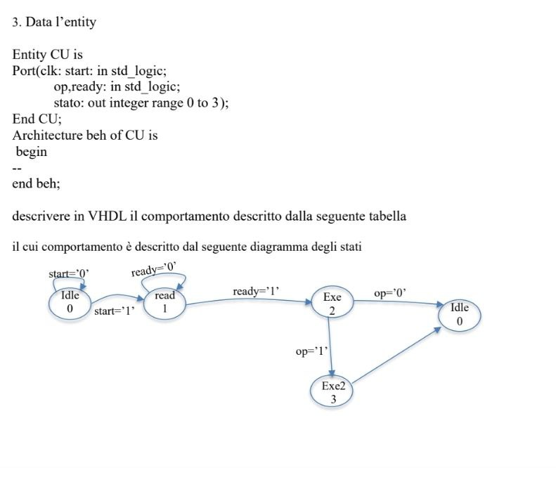
```vhdl
BRO

```
## 14/03/2022
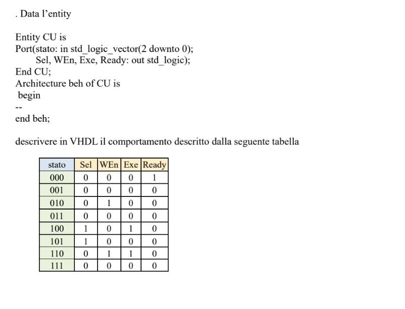
```vhdl
BRO

```
## 24/02/2022 T1
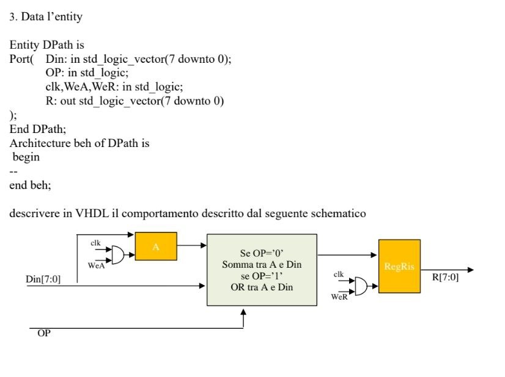
```vhdl
BRO

```
## 24/02/2022 T2
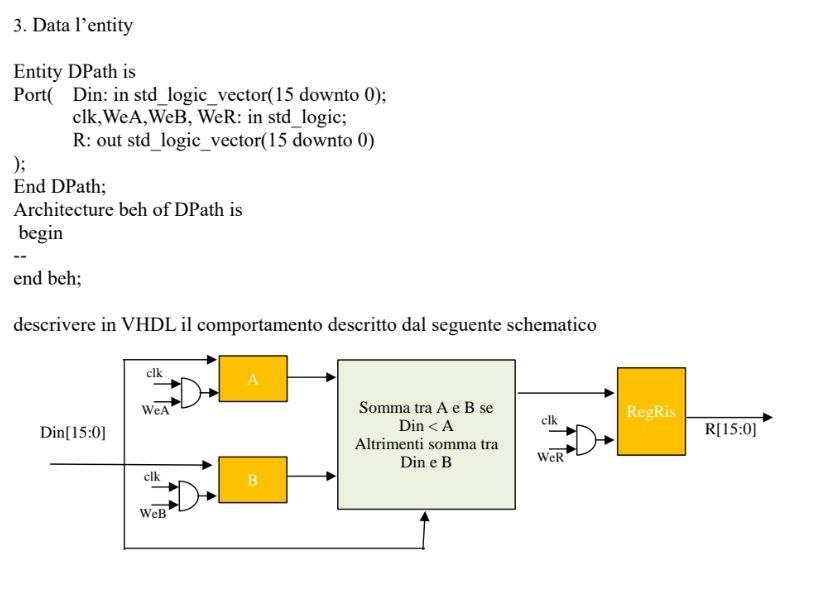
```vhdl
BRO

```
## 31/01/2022 (CONTROL UNIT/DIAGRAMMA A STATI)
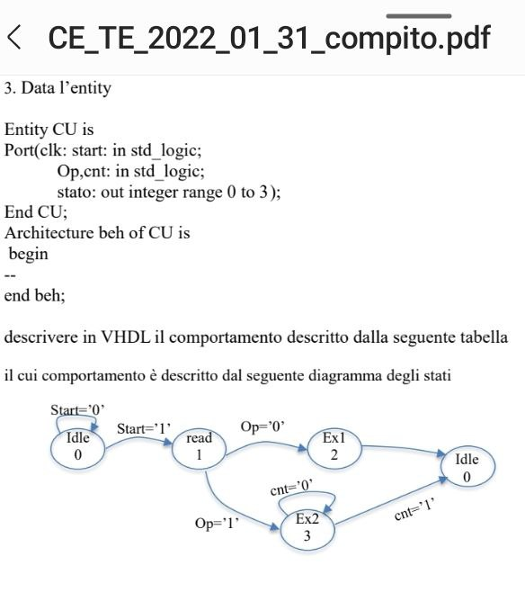
```vhdl
library ieee;
use ieee.std_logic_1164.all;  

Entity CU is
Port(clk, start: in std_logic;
Op,cnt: in std_logic; 
stato: out integer range 0 to 3 );
End CU;						   

Architecture beh of CU is 	

signal st: integer range 0 to 3;

begin
	
	stato<=st;	 
	
	process (clk)
	begin		
		if clk='0' and clk'EVENT then
			case st is
				when 0 => 
					if start='0' then st<=0;
					else st<=1;
					end if;
				when 1 =>
					if Op='0' then st<=2;
					else st<=3;
					end if;
				when 2 => st<=0;
				when others => 
					if cnt='0' then st<=3;
					else st<=0;
					end if;
			end case;
		end if;
	end process;
	
end beh;

```
## SPECIAL
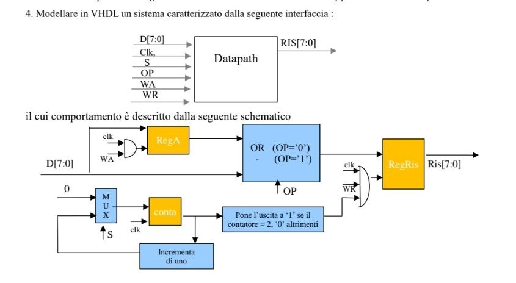
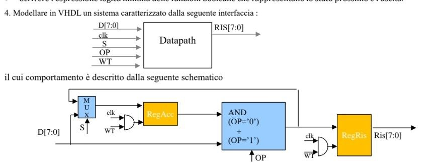
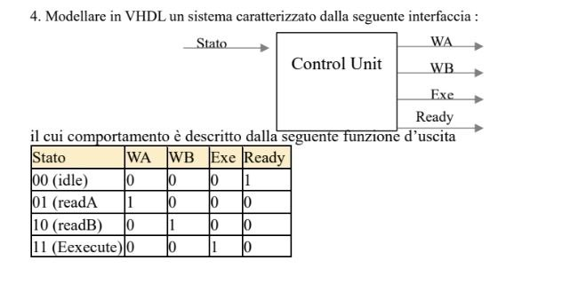
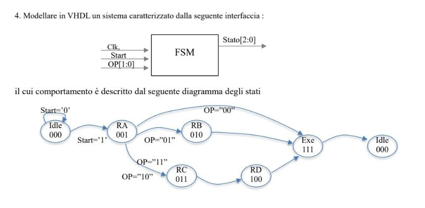
```vhdl
BRO

```

## 15/07/2021
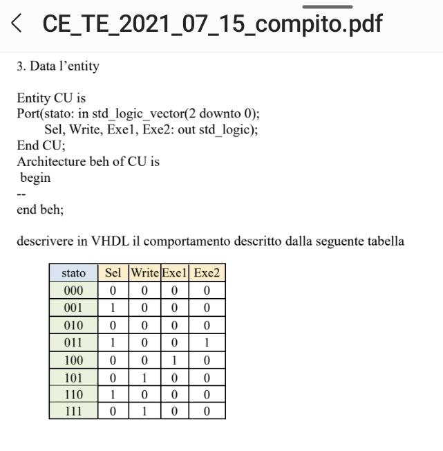
```vhdl
BRO

```
## 23/06/2021
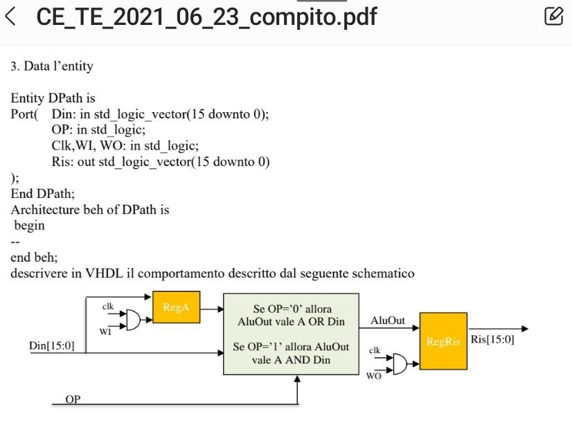
```vhdl
BRO

```
## 15/3/2021
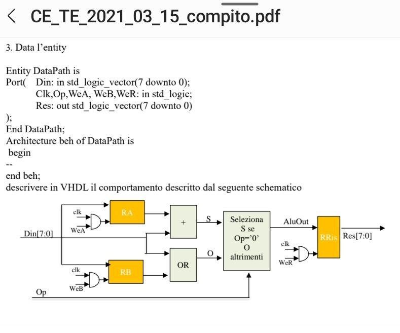
```vhdl
BRO

```
## 18/2/2021
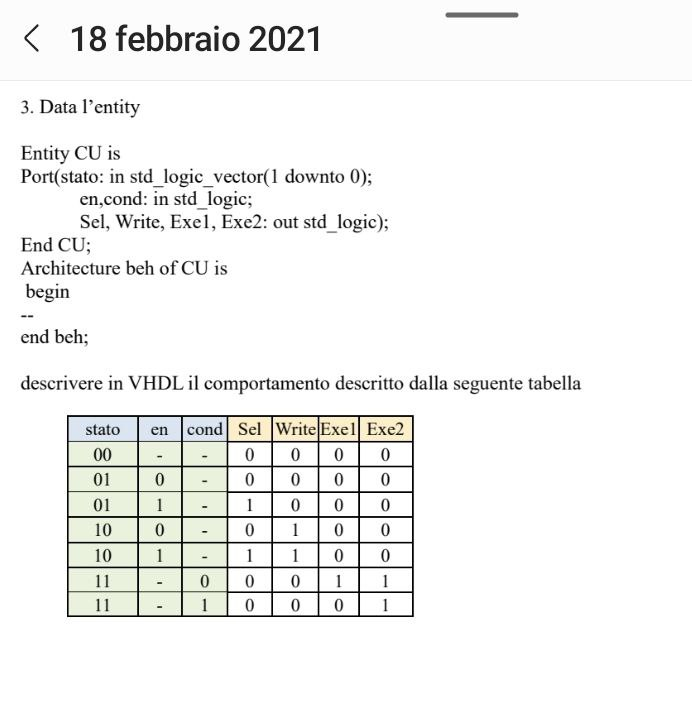
```vhdl
BRO

```
