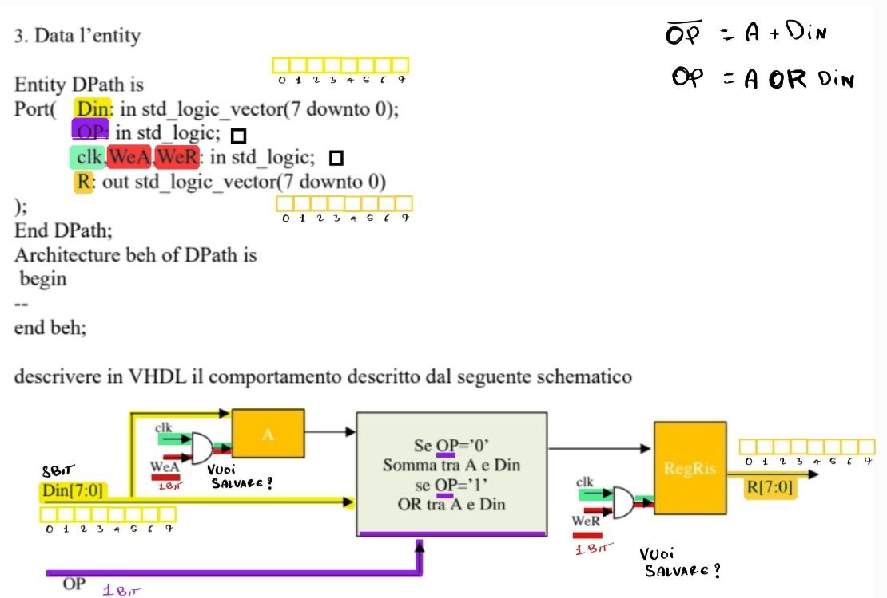

# Template Noti

## Tabella (CU)
 ```vhdl
 
 library ieee;
use ieee.std_logic_1164.all;

entity cu is
port(
	stato: in std_logic_vector(1 downto 0);
	en,cond:in std_logic;
	sel,w,exe1,exe2:out std_logic
);
end cu;

architecture beh of cu is
begin

	sel<='1' when stato ='00' or (en='1' and cond='0') else '0';
	w<='1' when ??? else '0';
	exe1<='1' when ??? else '0';
	exe2<='1' when ??? else '0';
	
end beh;
 
 
 
 ```
## Macchina a stati (CU)
```vhdl
library ieee;
use ieee.std_logic_1164.all;

Entity CU is
	port(
	clk,start,op,ready: in std_logic;
	stato:out integer range 0 to 3
	);
end CU;

architecture beh of CU is

signal st: integer range 0 to 3; --SEGNALE ST

begin
	
	stato<=st;               -- STATO<=SEGNALE
	
	process(clk)
	
	begin
		if clk='0' and clk'EVENT then -- QUANDO SALE IL CLOCK
		
			case st is  --case degli stati
			
			
				when 0=> --idle (STATO 1 INIZIALE)
				if start='0' then st<=0;
					else st<=1; -- VAI IN QUESTO STATO
					end if;
				when 1=> --read (STATO 2)
					if ready ='0' then st<=1; --VAI IN QUESTO STATO
					else st<=2; --VAI IN QUESTO STATO
					end if;
				when 2=> --exe1 (STATO 3)
					if op ='0' then st<=0 --VAI IN QUESTO STATO
					end if;
				
				when others=> --(STATO 4)
					st<=0; --VAI NELLO STATO INIZIALE
			end case;
		end if;	
	end process;
end beh;
 
 
 ```
## Datapath (DP)
```vhdl
library ieee;
use ieee.std_logic_1164.all;
use ieee.std_logic_unsigned.all;

Entity DPath is
	Port( 
		Din: in std_logic_vector(7 downto 0);  --DATA INGRESSO
		OP: in std_logic;			--OPERAZIONE 1 o 0
		clk,WeA,WeR: in std_logic;           --CLOCK + ENABLER REG_ACCUMULATORE E REG_USCITA
		R: out std_logic_vector(7 downto 0)  --DATA USCITA
);
End DPath;
Architecture beh of DPath is

signal regA, Ris: std_logic_vector(7 downto 0);  -- SEGNALE -> REG_ACCUMULATORE e REG_USCITA

begin

    Ris <= RegA + Din when OP = '0' else  -- ASSEGNO  (signal)REG_USCITA <=(signal)REG_ACCUMULATORE (+) (in)DataIN 
		   RegA or Din;		  -- OPPURE 			   (signal)REG_ACCUMULATORE OR (in)DataIN 
		   
	process(clk)
	begin
	if clk = '0' and clk' event then
		if WeA = '1' then
			regA <= Din; -- (signal)REG_ACCUMULATORE <=  (in)DataIN 
		end if;
		
		if WeR = '1' then
			R<= Ris;    -- (in)DATA USCITA <=  (signal)REG_USCITA 
		end if;
	end if;
	end process;
end beh;


 ```
# Compiti svolti
## 28/06/2022


```vhdl
library ieee;
use ieee.std_logic_1164.all;

Entity CU is
	port(
	clk,start,op,ready: in std_logic;
	stato:out integer range 0 to 3
	);
end CU;

architecture beh of CU is

signal st: integer range 0 to 3;

begin
	
	stato<=st;
	
	process(clk)
	
	begin
		if clk='0' and clk'EVENT then
			case st is
				when 0=> --idle
				if start='0' then st<=0;
					else st<=1;
					end if;
				when 1=> --read
					if ready ='0' then st<=1;
					else st<=2;
					end if;
				when 2=> --exe1 --vai in idle
					if op ='0' then st<=0
					end if;
				
				when others=> --exe2 --perde un ciclo e va in idle
					st<=0;
			end case;
		end if;	
	end process;
end beh;

```
## 14/03/2022

```vhdl
library ieee;
use ieee.std_logic_1164.all;

entity cu is
port(
	stato: in std_logic_vector(2 downto 0);
	sel,wen,exe,ready:out std_logic
);
end cu;

architecture beh of cu is
begin

	sel<='1' when stato ='100' or stato ='101' else '0';
	wen<='1' when stato ='010' or stato ='110' else '0';
	exe<='1' when stato ='100' or stato ='110' else '0';
	ready<='1' when stato ='000' else '0';

end beh;

```
## 24/02/2022 T1 (DATAPATH)


```vhdl
library ieee;
use ieee.std_logic_1164.all;
use ieee.std_logic_unsigned.all;

Entity DPath is
	Port( 
		Din: in std_logic_vector(7 downto 0);
		OP: in std_logic;
		clk,WeA,WeR: in std_logic;
		R: out std_logic_vector(7 downto 0)
);
End DPath;
Architecture beh of DPath is
signal regA, Ris: std_logic_vector(7 downto 0);
begin

    Ris <= RegA + Din when OP = '0' else
		   RegA or Din;
		   
	process(clk)
	begin
	if clk = '0' and clk' event then
		if WeA = '1' then
			regA <= Din;
		end if;
		
		if WeR = '1' then
			R<= Ris;
		end if;
	end if;
	end process;
end beh;


```

## 24/02/2022 T2 (DATAPATH)

```vhdl
library ieee;
use ieee.std_logic_1164.all;
use ieee.std_logic_unsigned.all; 

Entity DPath is
Port( Din: in std_logic_vector(15 downto 0);
clk,WeA,WeB, WeR: in std_logic;
R: out std_logic_vector(15 downto 0)
);
End DPath;
Architecture beh of DPath is 
signal A,B: std_logic_vector (15 downto 0);
begin
	process(clk)
	begin
			if clk='0' and clk'event then
				if WeA='1' then 
					A<=Din;
				end if;
				if WeB='1' then 
					B<=Din;
				end if;
				if WeR='1' then
					if Din<A then
						R<=A+B;
					else R<=Din+B;
					end if;
				end if;
			end if;
	end process;
end beh;

```
## 31/01/2022 (CONTROL UNIT/DIAGRAMMA A STATI)

```vhdl
library ieee;
use ieee.std_logic_1164.all;  

Entity CU is
Port(clk, start: in std_logic;
Op,cnt: in std_logic; 
stato: out integer range 0 to 3 );
End CU;						   

Architecture beh of CU is 	

signal st: integer range 0 to 3;

begin
	
	stato<=st;	 
	
	process (clk)
	begin		
		if clk='0' and clk'EVENT then
			case st is
				when 0 => 
					if start='0' then st<=0;
					else st<=1;
					end if;
				when 1 =>
					if Op='0' then st<=2;
					else st<=3;
					end if;
				when 2 => st<=0;
				when others => 
					if cnt='0' then st<=3;
					else st<=0;
					end if;
			end case;
		end if;
	end process;
	
end beh;

```
## SPECIAL


```vhdl
BRO

```

## 15/07/2021

```vhdl
library ieee;
use ieee.std_logic_1164.all;

entity cu is
port(
	stato: in std_logic_vector(2 downto 0);
	sel,w,exe1,exe2:out std_logic
);
end cu;

architecture beh of cu is
begin

	sel<='1' when stato ='001' or stato ='011' or stato ='110' else '0';
	w<='1' when stato ='101' or stato ='111' else '0';
	exe1<='1' when stato ='100'  else '0';
	exe1<='1' when stato ='011'  else '0';
	
end beh;

```
## 23/06/2021

```vhdl
BRO

```
## 15/3/2021

```vhdl
BRO

```
## 18/2/2021

```vhdl
library ieee;
use ieee.std_logic_1164.all;

entity cu is
port(
	stato: in std_logic_vector(1 downto 0);
	en,cond:in std_logic;
	sel,w,exe1,exe2:out std_logic
);
end cu;

architecture beh of cu is
begin

	sel<='1' when en ='1' and (stato ='10' or stato ='01') else '0';
	w<='1' when stato ='10'  else '0';
	exe1<='1' when stato ='11' and cond ='0' else '0';
	exe2<='1' when stato ='11'  else '0';
	
end beh;

```
## 26/01/2021 T1 (TABELLA)[CU]

```vhdl
library ieee;
use ieee.std_logic_1164.all;

Entity CU is
Port(	stato: 	in std_logic_vector(1 downto 0);
	en,cnt: 	in std_logic;
	WA, WB, Exe, Ready: out std_logic);
End CU;
Architecture beh of CU is 
 begin
   WA <= '1' when stato = "01" else '0';
   WB <= '1' when (stato = "01" and en='1') or stato = "10" else '0';
   exe <= '1' when stato = "11" and cnt='1'  else '0';
   Ready <= '1' when stato = "00" else '0';

end beh;

```
## 26/01/2021 T2 (DATAPATH)

```vhdl
library ieee;
use ieee.std_logic_1164.all;
use ieee.std_logic_signed.all; 

entity DPath is
Port(Din: in std_logic_vector(15 downto 0);
	 OP: in std_logic_vector(1 downto 0);
	 clk,WA, WR: in std_logic;
	 Ris: out std_logic_vector(15 downto 0)
);
end DPath; 

architecture beh of DPath is

signal RegA: std_logic_vector(15 downto 0);
begin 
	process(clk)
	begin		
		if clk'event and clk = '0' then
			if WA = '1' then RegA <= Din;
			end if;
			if WR = '1' then 
				case OP is
					when "00" => Ris <= RegA and Din;
					when "01" => Ris <= RegA or Din;
					when "10" => Ris <= RegA - Din;
					when "11" => Ris <= RegA + Din;
					when others => null;
				end case;
			end if;
		end if;
	end process;
end beh;

```
