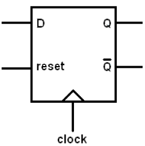

# Teoria
# Generic ControlUnit
```vhdl


library ieee;
use ieee.std_logic_1164.all;

entity XXX_cu is 
port(
clk, start,input1,input2: in std_logic; -- Segnali ingresso
xy : in std_logic_vector(1 downto 0); --Segnale ("00","01","11","10")
out1,out2,out3,out4,outN : out std_logic --Segnali uscita
);
end XXX_cu;

architecture beh of XXX_cu is

type stato is (S0,S1,S2,S3,Sn); -- stati della macchina
signal st : stato;		-- segnale del case

begin 
	-- MACCHINA A STATI--
	process(clk)
	begin 

	  if clk'event and clk ='0' then -- per la salita del clock
		case st is
			when S0 => if start ='1' then st <= S1 ;
						else st<= S0;
				   end if;
			when S1 => if input1 ='1' and input2 ='1'  then st <= S2 ;
				      elsif input1 ='1' and input2 ='0' then st <= Sn; 
				      else st<= S1;
				   end if;
			-- senza condizioni(salto immediato)
			when Sn => st <=S1;  
			
		end case;
	  end if;
	end process;
	--------------------
-- TABELLA
out1 <= '1' when st= S0 or st = S1 else '0';
 
out2 <= '0' when (st = S1 and input1 = '1 ') or st = Sn else '1':

out3 <= '1' when st = S2 or st= S3 else '0';

outN <= '1' when st = Sn else '0';

-- Fine tabella

		
end beh;

```

# Generic DataPath
```vhdl

library ieee;
use ieee.std_logic_1164.all;
use ieee.std_logic_unsigned.all;
entity XXX_dp is
port(
	clk,WA,WB,WR,selettoreA,selettoreb: in std_logic;
	A,B: in std_logic_vector(7 downto 0); -- VETTORE DI INGRESSO A 8 bit  [ B= IngressoB, A=IngressoA ] 
	selA,selB: out std_logic;  --SELETTORI A e B [selA=condizione1, selB=condizione2] 
	ris : out std_logic_vector(7 downto 0) -- VETTORE DI USCITA A 8 bit
);

end XXX_dp;

architecture beh of XXX_dp is
signal ma,mb :std_logic_vector(7 downto 0); --VETTORE DI 8 bit (REGISTRI INTERNI ) [ma= REGISTRO ,mb = REGISTRO]
begin
-- Multiplexer 	[selA=condizione1, selB=condizione2] 
selA <= '1' when mb /= ma else '0';  
selB <= '1' when mb < ma else '0';	
-----------------------------

process(clk)
begin

	if clk='0' and clk'event then   -- FRONTE DI DISCESA
	
		if WA = '1' then     -- SE IL REGISTRO (A) E' ABILITATO
			if condizione1 = '0' then ma <= A; -- SE IL SELETTORE IMPOSTA COPIA DI A
			else	ma<= ma + A;	-- SE IL SELETTORE IMPOSTA SOMMA DI A
			end if;
		end if;


		if WB = '1' then     -- SE IL REGISTRO (B) E' ABILITATO
			if condizione2 = '0' then mb <= B; -- SE IL SELETTORE IMPOSTA COPIA DI B
			else mb<= mb +B;     -- SE IL SELETTORE IMPOSTA SOMMA DI B
			end if;
		end if;

		if WR = '1' then ris <= mb; -- SE IL REGISTRO E' ABILITATO
		end if;

	end if;


end process;


end beh;


```


# Librerie 
```vhdl
--Questo è un commento
library ieee;
use ieee.std_logic_1164.all;
```

# ENTITY
Interfaccia con le porte (IN,OUT,INOUT,BUFFER)
```vhdl
Entity NOME_ENTITA is 
Port(	ck,start: in std_logic;
	OP: in std_logic_vector(1 downto 0);
	Stato: out std_logic_vector(2 downto 0)
);
End NOME_ENTITA;
```

# ARCHITECTURE (Behavioural)

```vhdl
Architecture beh of NOME_ENTITA is 
-- SEZIONE DICHIARATIVA

begin

-- SEZIONE ESECUTIVA

end beh;
```
# 2 Attributi Predefiniti utili 🌟

```vhdl

-- in
wait until Clk = ‘1’ and Clk’event and Clk’last_value = ‘0’;

-- abbiamo

clk'event 	--CLOCK è appena cambiato

-- e

clk'last_value  --ultimo valore di CLOCK

```

# Process  
Funzione che si attiva quando uno dei segnali della sensitivity list (a,b,c) cambia [EVENTO!]
[Funziona come un Do-While]
[Do a prescindere di a ,b ,c]->[aspetta una variazione]


```vhdl
ENTITY andor IS
Port ( a,b,c: IN std_logic; -- SENSITIVITY LIST
       a2, o2: OUT std_logic);
END andor;
ARCHITECTURE seq OF andOR IS
-- SEGNALI E VARIABILI
BEGIN
	PROCESS(a, b,c)		 -- [a2 ,o2]-> NON CAMBIANO!
		BEGIN		 -- [a2 ,o2]-> NON CAMBIANO!
		a2 <= a AND b;	 -- [a2 ,o2]-> NON CAMBIANO!
		o2<= a OR c;	 -- [a2 ,o2]-> NON CAMBIANO!
	END PROCESS;             -- [a2 ,o2]-> CAMBIANO ADESSO CONTEMPORANEAMENTE !
END seq;
```

### Update Segnali
Le assegnazioni dei segnali avvengono DOPO il process quindi alla fine dell'intera funzione
```vhdl
signal t: std_logic;           -- Dichiaro il segnale ausiliario t (Per comunicazione tra più process)
```

### Update Variabili
Per questo uso e dichiaro dentro il process delle variabili locali che cambiano immediatamente valore.

```vhdl
variable t: std_logic        -- Dichiaro la variabile ausiliaria t
```
# IF->THEN ELSIF->THEN ELSE->THEN ENDIF ( (N-1?) MULTIPLEXER IN CASCATA)
```vhdl
process (a,b,c,s)

begin
if (s = '1') then q<= a;
elsif (s = '0') then q<= b;
else q <= b;
end if;

end process;
```
# CASE (MULTIPLEXER N ENTRATE)

```vhdl
CASE espressione IS
	WHEN valore => istruz;
	WHEN valore2a | valore2b => istruz;
	WHEN valore3 to valoreN  => istruz;
	WHEN valore4 => istruz;
	WHEN OTHERS => istruz; -- default case
END CASE;
```
# while (⚠️) ➿

```vhdl
PROCESS(a,b)
VARIABLE ind: integer;
VARIABLE uguale: std_logic;
BEGIN
ind:=0; uguale:='1';
WHILE (uguale='1' AND ind<=7) LOOP
IF a(ind) /= b(ind) THEN uguale := '0';
END IF;
ind := ind +1;
END LOOP;
ris <= uguale;
END PROCESS;
```

# for (⚠️) ➿
```vhdl

PROCESS(a)
VARIABLE conta : integer range 0 to 8;
BEGIN
conta := 0;
FOR i IN 0 to 7 LOOP
IF a(i) = ‘1’ THEN conta := conta +1;
END IF;
END LOOP;
b <= conta;
END PROCESS;

```

# DECODER 2x4
Seleziono un uscita q(0,1,2,3) attraverso un entrata binaria i(00,01,10,11) 
```vhdl

entity decoder2x4 is
port ( i: in std_logic_vector(1 downto 0);
en: in std_logic;
q: out std_logic_vector( 0 to 3)
);
end decoder2x4;


architecture dataflow of decoder2x4 is
begin
q(0) <= ‘1’ when en =‘1’ AND i= “00” else
‘0’;
q(1) <= ‘1’ when en =‘1’ AND i= “01” else
‘0’;
q(2) <= ‘1’ when en =‘1’ AND i= “10” else
‘0’;
q(3) <= ‘1’ when en =‘1’ AND i= “11” else
‘0’;
end dataflow;

-- OPPURE 

architecture beh of decoder2x4 is
begin
q <= "1000" when en ='1' AND i= "00" else
"0100" when en ='1' AND i= "01" else
"0010" when en ='1' AND i= "10" else
"0001" when en ='1' AND i= "11" else
"0000";
end beh;

```
# FLIP-FLOP DATA (FFD) con RESET
L'entrata diventa l'uscita nella salita del clock


```vhdl
ENTITY ffd IS
PORT ( rst,d, clk: IN std_logic;
	q: OUT std_logic );
END ffd;

ARCHITECTURE behavioral OF ffd IS
BEGIN
	PROCESS(CLK,RST)
	BEGIN
		IF RST=‘1’ THEN q <= ‘0’ ;  -- SE PREMO RESET -> USCITA 0
		ELSIF clk=‘0’ AND clk’EVENT -- SE IL CLOCK PASSA DA 0 A 1
		THEN q<= d AFTER 2ns; 	    -- DOPO 2 NANOSEC DATA-> USCITA
		END IF;
	END PROCESS;
END behavioral;
```
# ALU (ADD,SUB,AND,OR) [IF]
```vhdl
entity alu is
	port (
	a,b: in std_logic_vector(3 downto 0);
	op: in integer rango 0 to 3;
	ris: out std_logic_vector(3 downto 0));
end alu;

architecture seq of alu is
begin
	process(a,b,op)
	begin
		if op = 0    then ris <= a and b;
		elsif op = 1 then ris <= a or b;
		elsif op = 2 then ris <= a+b;
		else ris <= a-b;
		end if;
	end process;
end seq;
```

# ALU (ADD,SUB,AND,OR) [CASE]

```vhdl
entity alu is
port ( 
	a, b: in std_logic_vector( 3 downto 0);
	op: in integer range 0 to 3;
	ris: out std_logic_vector( 3 downto 0));
end alu;

architecture seq of alu is
begin
	process(a,b,op)
	begin
		case op is
		when 0 => ris <= a and b;
		when 1 => ris <= a or b;
		when 2 => ris <= a + b;
		when others=> ris <= a - b;
		end case;
	end process;
end seq;
```
# Definizione nuovo tipo ❎
```vhdl
-- Enumerato
TYPE nome IS definizione;

TYPE quattrovalori IS ('0', '1', 'X','Z');
TYPE std_ulogic IS ('U','X','0','1','Z','W','L','H','-');
TYPE istruzioni IS (add, sub, lw, sw, mov, beq);
TYPE Stato IS (Fetch, Decode, Execute, MemAccess, WriteBack);

--Array
TYPE Nome_array IS ARRAY ( range_indici) OF Tipo_base;

TYPE data_bus IS array( 0 to 31) OF BIT;
TYPE byte IS ARRAY(7 downto 0) OF std_logic;
TYPE word IS ARRAY(15 downto 0) OF std_logic;

```
# Assegnamento di array ❎
```vhdl

ARCHITECTURE Behavioral OF test IS
SIGNAL x,y: word;
SIGNAL b,c: byte;
SIGNAL d,e: std_logic;
BEGIN
y <= "1010101010101010"; --assegnazione di un vettore
e <= '1’; -- assegnazione di un bit
d<= w(i); -- un solo elemento
b<=y(7 downto 0); -- un parte di un vettore (da 7 a 0)
x <=b&c; -- concatenazione tra due byte
-- alternativa
-- x(15 downto 8) <= b;
-- x(7 downto 0) <= c;
END Behavioral;

```
# Esempio FSM
## SEMAFORO CU (CONTROL UNIT) 🚦
```vhdl
library ieee;
use ieee.std_logic_1164.all;

entity semaforo_cu is
port (
start,clk,cond: in std_logic;	-- ingressi
red,yellow,green: out std_logic; -- stati_uscita
w_conta,selSoglia: out std_logic -- segnali interni
);
end semaforo_cu;

architecture beh of semaforo_cu is

type stato is (rosso,giallo_verde,verde,giallo_rosso); -- uso tipo enumerato per i 4 stati invece di 00,01,10,11
signal st: stato; -- STATO CORRENTE (segnale ausiliare)
begin
--MACCHINA_STATI_FINITI
process(clk)
begin
   if clk='0' and clk'event then -- fronte di salita
	case st is -- parte il case 	

	   -- Primo stato dal rosso 🔴
	   when rosso => if start= '1' then st <= giallo_verde;
			 else st <= rosso;
			 end if;
	   
	   -- Secondo stato GIALLOCORTO 🟡
	   when giallo_verde => if cond = '0' then st <= verde;
			        else st <= giallo_verde;
		                end if;
	   
	   -- Terzo stato VERDE 🟢
           when verde => if cond = '0'   then st <= giallo_rosso;
		         else st <= verde;
		         end if;
            
	   -- Quarto stato GIALLOLUNGO 🟡
	   when giallo_rosso => if cond = '0' then st <= rosso;
				else st <= giallo_rosso;
			        end if;

	end case;
   end if; 
end process;


-- GENERAZIONE SEGNALI DI CONTROLLO (TABELLA)

w_conta <= '0' when st = rosso else '1'; -- w conta vale 0 solo quando siamo sul rosso
selSoglia <= '1' when st = verde else '0'; -- selSogla p 1 solo quanso siamo sul verde

-- USCITE (TABELLA)

red <= '1' when st = rosso else '0' ; 			            -- Lampadina rossa ON  🔴
yellow <= '1' when st = giallo_rosso or st = giallo_verde else '0'; -- Lampadina gialla ON 🟡 
green <= '1' when st = verde else '0';                              -- Lampadina verde ON  🟢


end beh;
```
# Semaforo Datapath
```vhdl
👷
```

# Semaforo completo
```vhdl
👷
```

# TESTBENCH ESEMPIO (⚠️)
```vhdl

## 31/1/2022
```vhdl
BRO

```
```

# Generic Complete
```vhdl
👷
```
# Generic TestBench

```vhdl
👷
```


